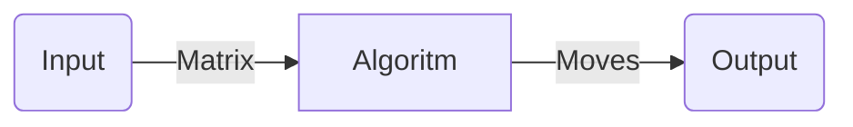
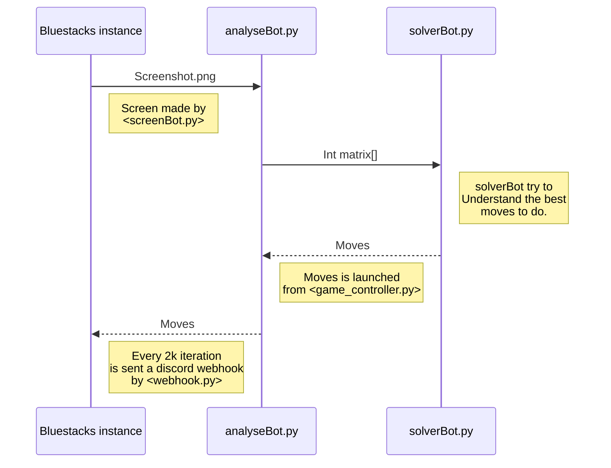

# What is "Automatic Game Solver"

It a software that is able to autonomously play an online game, using pixel analisys and decision making algoritms.
It is a 100% *Python* software.

## Dependencies

· Windows 10/11  
· Python ( Version > 3.0)  
· Bluestacks (10.0) -> [Bluestacks download](https://www.bluestacks.com/it/index.html)  
· Pip3 package manager  

  
  
## Main features

### 1. Pixel analisys

Made with OpenCV, is able to recognise the different between object in a specific set.

</img>

### 2. Game solver

Algorithm that takes an input matrix of objects and returns the best move.

### 3. Game controller

Create macro, using *pyautogui*, that can make the moves in the game.

### 4. Notification interface

Using Discord Webhook the bot is able to update his status.  

 

 Log - Notify 

</img>

 

 Update - Notify 

</img>

## Modules interaction

· Each module is called from Main.py

## How to Setup a new hardware (🇮🇹IT explanation) 

### Step1 ( Configurazione librerie )

1. scrivere "python3" nella powershell e scaricare python dallo store
2. pip install --upgrade pillow
3. pip3 install -r requirements.txt ( scarichi le librerie )

### Step2 ( Setting Visual Studio Code )

1. Eseguire uno screenshot avendo l'app aperta in fullscreen usando **/Tools/screen_help.py** (scelta=1) l'immagine
verrà salvata in **/Screenshot/screenshotFull.png**

1. Una volta che si ha il fullScreen dell'app aperta, lo si sposta nel desktop.

2. Una volta spostata nel desktop. Si avvia il programma **/Tools/screen_help.py** (scelta=2) e si apre l'immagine precedentemente fatta
in fullscreen.

1. Ora cambiando i parametri di **set_grill (x,y) e square_side**, generare l'immagine **output.png**

2. Aiutandoti con paint analizza l'immagine **output.png** e dovresti fare in modo di avere un puntino nello stesso punto per ogni item.

3. Dare in input a **Package/analyseBot.py** l'immagine **output.png** che ci sembra quella settata con la migliore griglia.
( RICORDATI DI CAMBIARE I PARAMETRI )

### Step3 ( Setting Bluestacks )

1. Vai in impostazioni e togli CTRL+M sui **shortcut**
2. Importa le Macro
3. Cambia le 3 Macro finali ( Alt+5  , Alt+6 , Alt+7)

### STEP4 ( Starting bot options )

Quando avvii il bot ti trovi davanti a 2 opzioni:

1. 's' -> avvia il bot ed esegue di **default 8000** iterazioni e poi riavvia una nuova partita
2. 'e' -> termina immediatamente la partita in corso e successivamente avvia altre partite con un numero di iterazioni pari a **8000**

### STEP-Extra

#### Nel caso si volesse usare un ambiente virtuale ecco come settarlo

1. pip3 install virtualenv
2. python3 -m venv __/path/to/new/virtual/environment__
3. Set-ExecutionPolicy -ExecutionPolicy RemoteSigned -Scope CurrentUser
4. .\Scripts\activate       ( attivazione ambiente virtuale)
5. pip3 install -r requirements.txt     (scarichi le librerie)
6. pip3 freeze > requirements.txt  ( nel caso vuoi salvare le librerie )
7. .\Script\deactivate   ( disattivazione ambiente virtuale)

