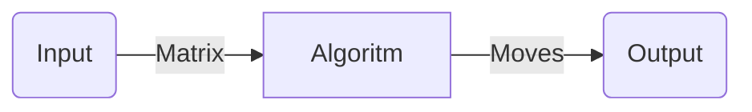

# What is "Automatic Game Solver"

It a software that is able to autonomously play an online game, using pixel analisys and decision making algoritms.
It is a 100% *Python* software.

## Dependencies

· Windows 10/11  
· Python ( v > 3.0)  
· Bluestacks -> [Bluestacks download](https://www.bluestacks.com/it/index.html)  
· Pip3 package manager  

## Main features ( Refers to V4 )

### 1. Pixel analisys

Made with OpenCV, is able to recognise the different between object in a specific set.

## 2. Game solver

Algorithm that takes an input matrix of objects and returns the best move.

## 3. Game controller

Create macro, using *pyautogui*, that can make the moves in the game.

## 4. Notification interface

Using Discord Webhook the bot is able to update his status.

