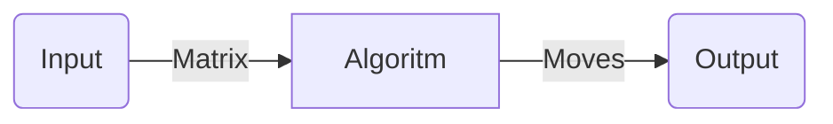

# V2

(-) Messy code.
(-) Macro's are not native, they are made with Bluestacks.
(-) File *requirements.txt* not available

## Main features

### 1. Pixel analisys

Made with OpenCV, is able to recognise the different between object in a specific set.

## 2. Game solver

Algorithm that takes an input matrix of objects and returns the best move.

## 3. Game controller

Create Bluestacks's macro's.

## 4. Notification interface

Using Discord Webhook the bot is able to update his status.
